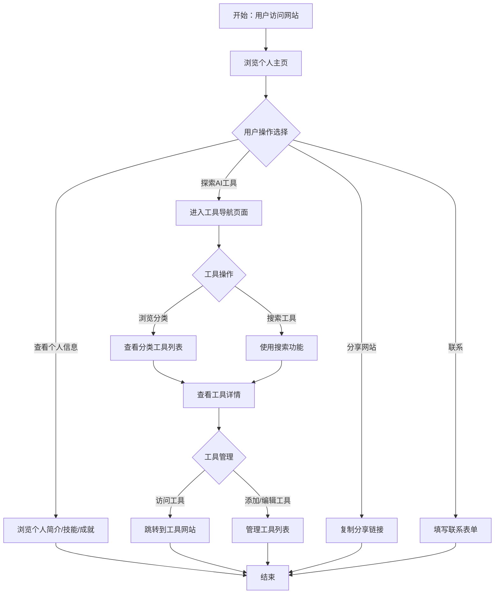

# 产品需求文档：个人主页 + AI工具导航站 - V1.0

## 1. 综述 (Overview)

### 1.1 项目背景与核心问题
随着AI技术的快速发展，各种AI工具层出不穷，用户面临以下核心问题：
1. 收藏的AI工具太多，收藏夹乱七八糟，急需一个整理和展示的地方
2. 想对外展示自己，但纯文字的自我介绍太无聊，没有亮点
3. 想给朋友推荐好用的工具，但没有一个集中的链接发给他们

本项目旨在开发一个"个人主页 + AI工具导航站"的网页产品，解决上述问题，为用户提供一个集个人品牌展示与AI工具导航于一体的平台。

### 1.2 核心业务流程 / 用户旅程地图
1. **阶段一：网站访问与个人主页浏览** - 用户访问网站并了解个人信息
2. **阶段二：AI工具导航与探索** - 用户浏览和查找感兴趣的AI工具
3. **阶段三：工具管理与个性化** - 用户管理和个性化AI工具列表
4. **阶段四：网站分享与互动** - 用户分享网站给朋友并与网站所有者互动

### 1.3 Mermaid 图（流程/状态/时序）

#### 1.3.1 用户操作流（必填）


## 2. 用户故事详述 (User Stories)

### 阶段一：网站访问与个人主页浏览

---

#### **US-01: 作为访客，我希望查看个人主页信息，以便于了解网站所有者的背景和专业技能**
*   **价值陈述 (Value Statement)**:
    *   **作为** 访客
    *   **我希望** 查看个人主页信息，包括简介、头像、职业、技能标签、社交媒体链接和个人成就
    *   **以便于** 了解网站所有者的背景和专业技能
*   **业务规则与逻辑 (Business Logic)**:
    1.  **前置条件**: 访客通过链接访问网站
    2.  **操作流程 (Happy Path)**:
        *   访客打开网站链接
        *   系统加载个人主页
        *   访客浏览个人简介、头像、职业信息
        *   访客查看技能标签和个人成就
        *   访客点击社交媒体链接跳转到相应平台
    3.  **异常处理 (Error Handling)**:
        *   网络连接失败：显示错误提示
        *   页面加载超时：显示加载动画和重试按钮
*   **验收标准 (Acceptance Criteria)**:
    *   **场景1: 正常访问**
        *   **GIVEN** 网络连接正常
        *   **WHEN** 访客访问网站链接
        *   **THEN** 网站成功加载，显示个人主页信息
    *   **场景2: 查看个人信息**
        *   **GIVEN** 个人主页已加载
        *   **WHEN** 访客浏览页面
        *   **THEN** 页面显示完整的个人简介、头像、职业信息、技能标签和个人成就
    *   **场景3: 点击社交媒体链接**
        *   **GIVEN** 个人主页已加载
        *   **WHEN** 访客点击社交媒体链接
        *   **THEN** 系统在新标签页打开相应的社交媒体页面
*   **页面布局线框图 (ASCII Wireframe)**:
    ```text
    +---------------------------------------------------+
    |                   导航栏                           |
    |                                                   |
    |  [个人主页] [AI工具] [联系我]                     |
    +---------------------------------------------------+
    |                                                   |
    |                    个人简介                        |
    |                                                   |
    |  +-------------+  +-----------------------------+ |
    |  |             |  |  姓名                        | |
    |  |   头像      |  |  职业                        | |
    |  |             |  |  简短介绍                    | |
    |  +-------------+  +-----------------------------+ |
    |                                                   |
    |                    技能标签                        |
    |                                                   |
    |  [技能1] [技能2] [技能3] [技能4] [技能5]          |
    |                                                   |
    |                  个人成就                          |
    |                                                   |
    |  +-----------------------------+  +-------------+ |
    |  |  成就1: 描述                 |  |  成就2: 描述  | |
    |  +-----------------------------+  +-------------+ |
    |                                                   |
    |                  社交媒体链接                      |
    |                                                   |
    |  [GitHub] [LinkedIn] [X] [Email]                 |
    |                                                   |
    +---------------------------------------------------+
    ```

---

#### **US-02: 作为网站所有者，我希望管理个人主页内容，以便于及时更新个人信息和成就**
*   **价值陈述 (Value Statement)**:
    *   **作为** 网站所有者
    *   **我希望** 管理个人主页内容，包括修改个人简介、更新技能标签、添加新成就和社交媒体链接
    *   **以便于** 及时更新个人信息和成就，保持内容的时效性
*   **业务规则与逻辑 (Business Logic)**:
    1.  **前置条件**: 网站所有者登录管理后台
    2.  **操作流程 (Happy Path)**:
        *   网站所有者登录管理后台
        *   进入个人主页管理页面
        *   修改个人简介、头像、职业信息
        *   更新技能标签列表
        *   添加/编辑/删除个人成就
        *   更新社交媒体链接
        *   保存更改
    3.  **异常处理 (Error Handling)**:
        *   登录失败：显示错误提示
        *   保存失败：显示错误信息并提供重试选项
*   **验收标准 (Acceptance Criteria)**:
    *   **场景1: 登录管理后台**
        *   **GIVEN** 网站所有者输入正确的登录凭证
        *   **WHEN** 点击登录按钮
        *   **THEN** 成功进入管理后台
    *   **场景2: 更新个人信息**
        *   **GIVEN** 已登录管理后台
        *   **WHEN** 修改个人简介并保存
        *   **THEN** 个人主页显示更新后的信息
    *   **场景3: 管理技能标签**
        *   **GIVEN** 已登录管理后台
        *   **WHEN** 添加/删除技能标签并保存
        *   **THEN** 个人主页显示更新后的技能标签列表

### 阶段二：AI工具导航与探索

---

#### **US-03: 作为访客，我希望浏览分类的AI工具列表，以便于发现感兴趣的工具**
*   **价值陈述 (Value Statement)**:
    *   **作为** 访客
    *   **我希望** 浏览分类的AI工具列表，查看工具名称、简介和链接
    *   **以便于** 发现感兴趣的工具并了解其功能
*   **业务规则与逻辑 (Business Logic)**:
    1.  **前置条件**: 访客进入工具导航页面
    2.  **操作流程 (Happy Path)**:
        *   访客点击导航栏的"AI工具"选项
        *   系统显示工具分类列表
        *   访客选择一个分类
        *   系统显示该分类下的工具卡片列表
        *   访客浏览工具卡片，查看工具名称、简介
        *   访客点击工具卡片查看详情或直接跳转到工具网站
    3.  **异常处理 (Error Handling)**:
        *   分类下无工具：显示"暂无工具"提示
        *   页面加载失败：显示错误提示和重试按钮
*   **验收标准 (Acceptance Criteria)**:
    *   **场景1: 浏览工具分类**
        *   **GIVEN** 访客进入工具导航页面
        *   **WHEN** 查看分类列表
        *   **THEN** 页面显示完整的工具分类列表
    *   **场景2: 查看分类工具**
        *   **GIVEN** 访客选择一个工具分类
        *   **WHEN** 系统加载该分类下的工具
        *   **THEN** 页面显示该分类下的工具卡片列表，每张卡片包含工具名称、简介和链接
    *   **场景3: 点击工具链接**
        *   **GIVEN** 工具卡片已显示
        *   **WHEN** 访客点击工具链接
        *   **THEN** 系统在新标签页打开相应的工具网站
*   **页面布局线框图 (ASCII Wireframe)**:
    ```text
    +---------------------------------------------------+
    |                   导航栏                           |
    |                                                   |
    |  [个人主页] [AI工具] [联系我]                     |
    +---------------------------------------------------+
    |                                                   |
    |                    搜索框                          |
    |                                                   |
    |  [搜索工具...]                                    |
    |                                                   |
    |                    工具分类                        |
    |                                                   |
    |  [写作工具] [设计工具] [编程工具] [研究工具]      |
    |                                                   |
    |                    工具列表                        |
    |                                                   |
    |  +-----------------------------+  +-------------+ |
    |  |  工具名称                   |  |  工具名称    | |
    |  |  工具简介                   |  |  工具简介    | |
    |  |  [标签1] [标签2]            |  |  [标签1]     | |
    |  |  [访问链接]                 |  |  [访问链接]  | |
    |  +-----------------------------+  +-------------+ |
    |                                                   |
    |  +-----------------------------+  +-------------+ |
    |  |  工具名称                   |  |  工具名称    | |
    |  |  工具简介                   |  |  工具简介    | |
    |  |  [标签1] [标签2]            |  |  [标签1]     | |
    |  |  [访问链接]                 |  |  [访问链接]  | |
    |  +-----------------------------+  +-------------+ |
    |                                                   |
    +---------------------------------------------------+
    ```

---

#### **US-04: 作为访客，我希望使用搜索功能查找特定工具，以便于快速找到我需要的工具**
*   **价值陈述 (Value Statement)**:
    *   **作为** 访客
    *   **我希望** 使用搜索功能查找特定工具，输入关键词搜索工具名称和简介
    *   **以便于** 快速找到我需要的工具，节省浏览时间
*   **业务规则与逻辑 (Business Logic)**:
    1.  **前置条件**: 访客进入工具导航页面
    2.  **操作流程 (Happy Path)**:
        *   访客进入工具导航页面
        *   在搜索框中输入关键词
        *   系统实时显示搜索结果
        *   访客点击搜索结果查看工具详情或跳转到工具网站
    3.  **异常处理 (Error Handling)**:
        *   无搜索结果：显示"未找到相关工具"提示
        *   搜索框为空：显示所有工具
*   **验收标准 (Acceptance Criteria)**:
    *   **场景1: 搜索工具**
        *   **GIVEN** 访客进入工具导航页面
        *   **WHEN** 在搜索框中输入关键词并提交
        *   **THEN** 页面显示与关键词相关的工具列表
    *   **场景2: 无搜索结果**
        *   **GIVEN** 访客输入不存在的工具名称
        *   **WHEN** 提交搜索
        *   **THEN** 页面显示"未找到相关工具"提示
    *   **场景3: 清空搜索框**
        *   **GIVEN** 访客已执行搜索
        *   **WHEN** 清空搜索框
        *   **THEN** 页面显示所有工具列表

### 阶段三：工具管理与个性化

---

#### **US-05: 作为网站所有者，我希望添加、编辑和删除AI工具，以便于管理工具列表的内容**
*   **价值陈述 (Value Statement)**:
    *   **作为** 网站所有者
    *   **我希望** 添加、编辑和删除AI工具，包括工具名称、简介、分类、标签和链接
    *   **以便于** 管理工具列表的内容，保持工具列表的准确性和时效性
*   **业务规则与逻辑 (Business Logic)**:
    1.  **前置条件**: 网站所有者登录管理后台
    2.  **操作流程 (Happy Path)**:
        *   网站所有者登录管理后台
        *   进入工具管理页面
        *   点击"添加工具"按钮
        *   填写工具名称、简介、分类、标签和链接
        *   点击"保存"按钮
        *   或选择现有工具进行编辑或删除
    3.  **异常处理 (Error Handling)**:
        *   表单验证失败：显示错误提示
        *   保存失败：显示错误信息并提供重试选项
        *   删除失败：显示错误信息并提供重试选项
*   **验收标准 (Acceptance Criteria)**:
    *   **场景1: 添加新工具**
        *   **GIVEN** 已登录管理后台
        *   **WHEN** 填写工具信息并保存
        *   **THEN** 新工具成功添加到工具列表中
    *   **场景2: 编辑现有工具**
        *   **GIVEN** 已登录管理后台
        *   **WHEN** 修改工具信息并保存
        *   **THEN** 工具列表显示更新后的工具信息
    *   **场景3: 删除工具**
        *   **GIVEN** 已登录管理后台
        *   **WHEN** 选择工具并点击删除按钮
        *   **THEN** 工具成功从工具列表中删除

---

#### **US-06: 作为访客，我希望标记常用工具，以便于快速访问我经常使用的工具**
*   **价值陈述 (Value Statement)**:
    *   **作为** 访客
    *   **我希望** 标记常用工具，将其添加到收藏列表中
    *   **以便于** 快速访问我经常使用的工具，提高使用效率
*   **业务规则与逻辑 (Business Logic)**:
    1.  **前置条件**: 访客进入工具导航页面
    2.  **操作流程 (Happy Path)**:
        *   访客进入工具导航页面
        *   浏览工具列表
        *   点击工具卡片上的收藏按钮
        *   系统将工具添加到收藏列表
        *   访客可以在收藏列表中查看和管理已收藏的工具
    3.  **异常处理 (Error Handling)**:
        *   收藏失败：显示错误提示
        *   取消收藏失败：显示错误提示
*   **验收标准 (Acceptance Criteria)**:
    *   **场景1: 收藏工具**
        *   **GIVEN** 访客浏览工具列表
        *   **WHEN** 点击工具卡片上的收藏按钮
        *   **THEN** 工具成功添加到收藏列表，收藏按钮状态改变
    *   **场景2: 查看收藏列表**
        *   **GIVEN** 访客已收藏工具
        *   **WHEN** 进入收藏列表页面
        *   **THEN** 页面显示所有已收藏的工具
    *   **场景3: 取消收藏**
        *   **GIVEN** 访客在收藏列表中
        *   **WHEN** 点击工具卡片上的取消收藏按钮
        *   **THEN** 工具成功从收藏列表中移除，收藏按钮状态改变

### 阶段四：网站分享与互动

---

#### **US-07: 作为访客，我希望分享网站链接给朋友，以便于推荐好用的AI工具和个人主页**
*   **价值陈述 (Value Statement)**:
    *   **作为** 访客
    *   **我希望** 分享网站链接给朋友，通过社交媒体或复制链接的方式
    *   **以便于** 推荐好用的AI工具和个人主页，让朋友也能受益
*   **业务规则与逻辑 (Business Logic)**:
    1.  **前置条件**: 访客访问网站
    2.  **操作流程 (Happy Path)**:
        *   访客访问网站
        *   点击页面上的分享按钮
        *   选择分享方式（社交媒体或复制链接）
        *   系统打开相应的社交媒体分享界面或复制链接到剪贴板
        *   访客完成分享操作
    3.  **异常处理 (Error Handling)**:
        *   复制链接失败：显示错误提示
        *   社交媒体分享失败：显示错误提示
*   **验收标准 (Acceptance Criteria)**:
    *   **场景1: 复制链接**
        *   **GIVEN** 访客点击分享按钮
        *   **WHEN** 选择"复制链接"选项
        *   **THEN** 链接成功复制到剪贴板，显示"链接已复制"提示
    *   **场景2: 社交媒体分享**
        *   **GIVEN** 访客点击分享按钮
        *   **WHEN** 选择社交媒体平台
        *   **THEN** 系统打开相应的社交媒体分享界面，预填分享内容

---

#### **US-08: 作为访客，我希望通过联系表单与网站所有者交流，以便于提出问题或合作意向**
*   **价值陈述 (Value Statement)**:
    *   **作为** 访客
    *   **我希望** 通过联系表单与网站所有者交流，填写姓名、邮箱和留言内容
    *   **以便于** 提出问题或合作意向，与网站所有者建立联系
*   **业务规则与逻辑 (Business Logic)**:
    1.  **前置条件**: 访客进入联系页面或点击联系按钮
    2.  **操作流程 (Happy Path)**:
        *   访客进入联系页面或点击联系按钮
        *   填写姓名、邮箱和留言内容
        *   点击"提交"按钮
        *   系统发送邮件给网站所有者
        *   显示提交成功提示
    3.  **异常处理 (Error Handling)**:
        *   表单验证失败：显示错误提示
        *   提交失败：显示错误信息并提供重试选项
*   **验收标准 (Acceptance Criteria)**:
    *   **场景1: 提交联系表单**
        *   **GIVEN** 访客填写完整的联系表单
        *   **WHEN** 点击"提交"按钮
        *   **THEN** 表单成功提交，显示"提交成功"提示，网站所有者收到邮件
    *   **场景2: 表单验证**
        *   **GIVEN** 访客填写不完整的联系表单
        *   **WHEN** 点击"提交"按钮
        *   **THEN** 系统显示表单验证错误提示，指示缺失的字段
    *   **场景3: 提交失败**
        *   **GIVEN** 网络连接不稳定
        *   **WHEN** 访客提交联系表单
        *   **THEN** 系统显示提交失败提示，并提供重试按钮
*   **页面布局线框图 (ASCII Wireframe)**:
    ```text
    +---------------------------------------------------+
    |                   导航栏                           |
    |                                                   |
    |  [个人主页] [AI工具] [联系我]                     |
    +---------------------------------------------------+
    |                                                   |
    |                    联系表单                        |
    |                                                   |
    |  +-----------------------------------------------+ |
    |  |  姓名: [输入框]                               | |
    |  |  邮箱: [输入框]                               | |
    |  |  留言: [文本域]                               | |
    |  |                                               | |
    |  |  [提交按钮]                                   | |
    |  +-----------------------------------------------+ |
    |                                                   |
    |                  联系方式                          |
    |                                                   |
    |  邮箱: example@email.com                          |
    |  社交媒体: [GitHub] [LinkedIn] [X]               |
    |                                                   |
    +---------------------------------------------------+
    ```
